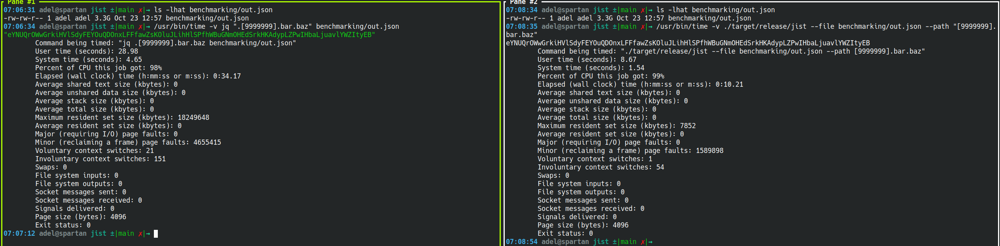

# Overview

`jist` attempts to find the complete JSON value (string, number, bool, or JSON object) for a given search key.

## `jq`?

| 3.3GB input       |    jist    |   jq    |
|:------------------|:----------:|:-------:|
| Time              |   2.05s    | 34.17s  |
| Memory            |    8MB     | 18GB 😱 |
| Throughput        | 1600MB/s ✅ | 96MB/s  |

_(Test machine: Intel i7-12700H, 64GB DDR5@4800MT RAM)_


## Examples
```
$ jist --data '{"a":"b", "c": {"d": ["e", "f", "g"]}}' --path "c.d"
["e", "f", "g"]
```

Or

```
$ jist -d '[{"a": "b"}, {"c": {"d": "e"}}]' -p "[1].c"
{"d": "e"}
```

Or
```
$ jist -f my.json -p "[1054041].c" --buffsize 50000000
{"d": "e"}
```

One of the use cases I had in mind was being able to extract values from JSON objects like access tokens programmatically for setting up config files easily without having to perform `jq` gymnastics. You know the JSON data shape and key you're looking for, just declare what you want.

## Interface:

1. Find the value of an exact match

   `jist` can take any valid JSON as input including an array root type. It expects the search key to be valid given the requested key.

```
$ curl https://api.github.com/repos/adelamodwala/rustbook/commits?per_page=1 | jist -p "[0].commit.author"
{
    "name": "adelamodwala",
    "email": "adel.amodwala@gmail.com",
    "date": "2023-11-06T20:36:53Z"
}
```

2. You can find values for keys that are deeply nested

```
$ wget https://api.github.com/repos/adelamodwala/rustbook/commits?per_page=1 | jist -p "[0].commit.author.name"
adelamodwala
```

3. If the root object is an array, then it's named `root` by default. All arrays are used like Javascript arrays syntactically.

```
$ wget https://api.github.com/repos/adelamodwala/rustbook/commits?per_page=1 | jist -p "[0].parents"
[]
```

# Algorithm
`jist` uses a streaming approach to keep memory usage low, and uses `json-tools` crate to get a lexer iterator. Put together, we can scan through a JSON string/file from the top and keep track of depths compared to our target depth without ever unmarshalling JSON into memory. Once we reach our target depth and match all the expected indices/keys, `jist` returns the result.  

## Goals

- [x] It should find the full JSON value of a given search key. If the JSON data supplied provides an incomplete JSON value, the program should return an error.
- [x] JSON object size should not impact memory usage while fully utilizing a single CPU core 
- [x] As long as the search key is appropriate and a complete JSON value can be found, the input JSON object does not need to be complete or correctly formed.
- [x] Parsing the entire input JSON object is not necessary, simply finding the search key path using JSON format is sufficient
- [x] Streaming the JSON input should be possible, though will not be part of the starting design
- [ ] Feature: generate JSON schema, like super fast
- [ ] Search over compressed files like `gzip` and `bgzip`
- [ ] SIMD: the final frontier?
